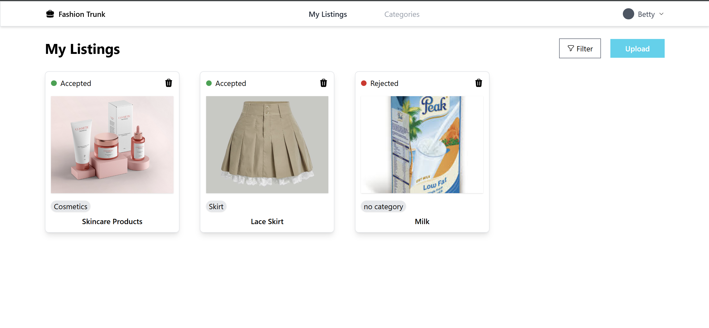
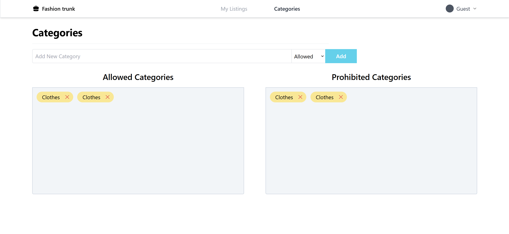
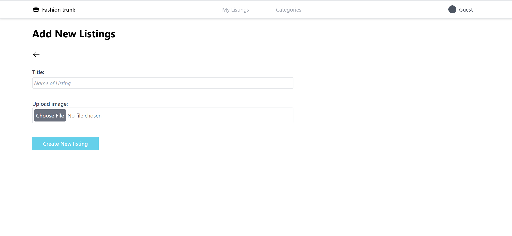
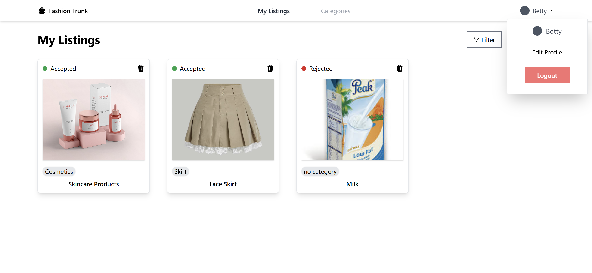
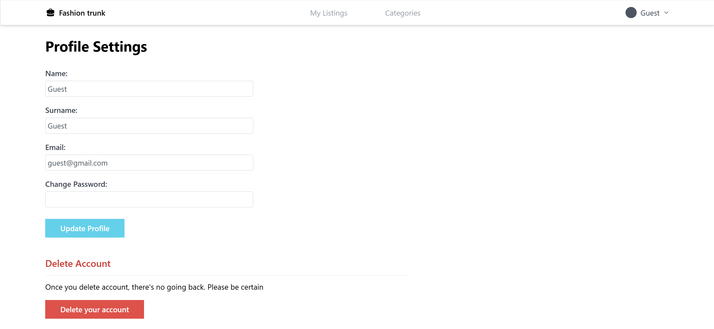
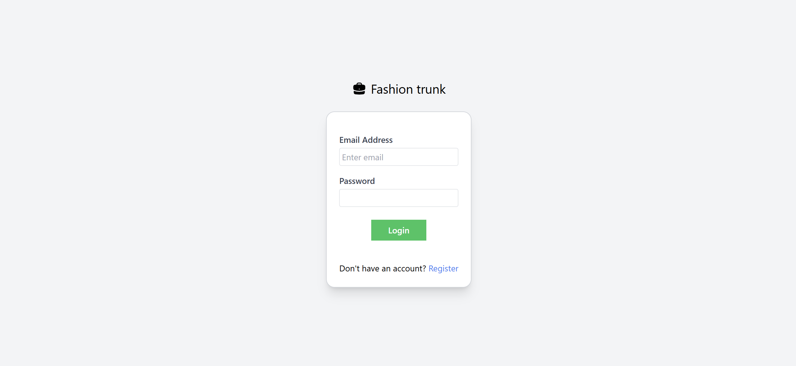
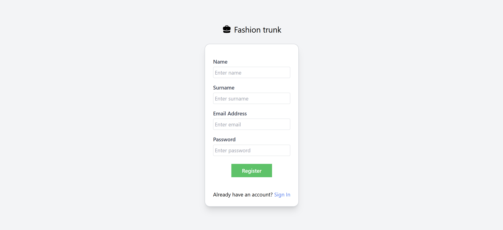

### My Fashion Trunk

The Application uses a React frontend and Springboot backend. 
It integrates Google Cloud Vision API for object detection and
Google Cloud Store for storage of images, and it's connected to a PostgreSQL database .

## How the Application looks like on the frontend

Home view

categories for editing categories

add listing page for adding items

Drop down menu for profile

Profile settings for account update and delete

login page

register page for new users

### Environment variables needed on the backend: 
SPRING_DATASOURCE_USERNAME 
SPRING_DATASOURCE_PASSWORD 
GOOGLE_APPLICATION_CREDENTIALS 
GOOGLE_CLOUD_PROJECT

### Environment variable needed on the frontend:  
VITE_SERVER_APP_URL
